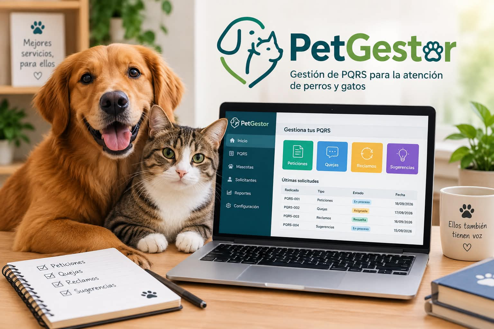

# 3. Nombre del proyecto y detalles

## Nombre del proyecto

**PetGestor**

## Descripción del proyecto

PetGestor es un sistema desarrollado en Python para la gestión de Peticiones, Quejas, Reclamos y Sugerencias (PQRS) relacionadas con la atención de perros y gatos.

El sistema permitirá registrar, consultar y gestionar las PQRS, facilitando el seguimiento de cada solicitud y el control de su estado y fecha límite de respuesta.

## Imagen representativa

